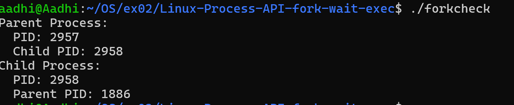
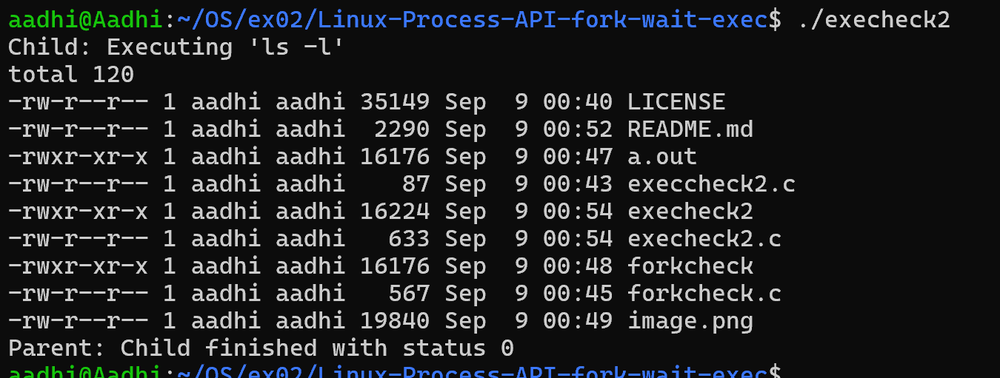

# Linux-Process-API-fork-wait-exec-
Ex02-Linux Process API-fork(), wait(), exec()
# Ex02-OS-Linux-Process API - fork(), wait(), exec()
Operating systems Lab exercise


# AIM:
To write C Program that uses Linux Process API - fork(), wait(), exec()

# DESIGN STEPS:

### Step 1:

Navigate to any Linux environment installed on the system or installed inside a virtual environment like virtual box/vmware or online linux JSLinux (https://bellard.org/jslinux/vm.html?url=alpine-x86.cfg&mem=192) or docker.

### Step 2:

Write the C Program using Linux Process API - fork(), wait(), exec()

### Step 3:

Test the C Program for the desired output. 

# PROGRAM:

## C Program to create new process using Linux API system calls fork() and getpid() , getppid() and to print process ID and parent Process ID using Linux API system calls

```
#include <stdio.h>
#include <unistd.h>
#include <sys/types.h>

int main() {
    pid_t pid;

    // create a new process
    pid = fork();

    if (pid < 0) {
        perror("fork failed");
        return 1;
    }

    if (pid == 0) {
        // Child process
        printf("Child Process:\n");
        printf("  PID: %d\n", getpid());
        printf("  Parent PID: %d\n", getppid());
    } else {
        // Parent process
        printf("Parent Process:\n");
        printf("  PID: %d\n", getpid());
        printf("  Child PID: %d\n", pid);
    }

    return 0;
}
```


##OUTPUT



## C Program to execute Linux system commands using Linux API system calls exec() , exit() , wait() family

## Program
```
#include <stdio.h>
#include <unistd.h>
#include <sys/types.h>
#include <sys/wait.h>

int main() {
    pid_t pid;
    int status;

    pid = fork();

    if (pid < 0) {
        perror("fork failed");
        return 1;
    }

    if (pid == 0) {
        // Child process replaces itself with ls command
        printf("Child: Executing 'ls -l'\n");
        execl("/bin/ls", "ls", "-l", NULL);

        // If exec fails
        perror("exec failed");
    } else {
        // Parent waits for child to complete
        wait(&status);
        printf("Parent: Child finished with status %d\n", WEXITSTATUS(status));
    }

    return 0;
}
```

##OUTPUT




# RESULT:
The programs are executed successfully.
